```python
from __future__ import print_function
```

#Probability and Statistics in Python

##Introduction to Statistics

###1: Equal interval scales

Statistics is, at the core, about counting and measuring.

In order to do both effectively, we have to define scales on which we can count.

One type of scale is called equal interval.

Think of the speed of a car. 5 miles per hour is 5 miles per hour, no matter what the current speed is.

The difference between 60 and 55 miles per hour will always equal the difference between 10 and 5 miles per hour in real-world terms.

Another type of scale is a logarithmic scale.

The difference between a 6 and a 5 on the Richter scale is more than the difference between a 4 and 5.

This is because each number on the Richter scale means that the earthquake had 10 times the shaking amplitude of the previous number.

So, a 6 is 10 times more powerful (technically, powerful is the wrong term, but it makes explaining easier) than a 5, which is 10 times more powerful than a 4. A 6 is 100 times as powerful as a 4.

We can calculate the mean of values on an equal interval scale by adding up all the values and dividing by the number of values.

We could do the same for values on a non-equal interval scale, but the results wouldn't be meaningful, because of the differences between units.

####Instructions

Compute the mean of car_speeds and assign it to mean_car_speed.

Compute the mean of earthquake_intensities and assign the result to mean_earthquake_intensities. This value will not be meaningful, because we can't average values on a logarithmic scale this way.


```python
car_speeds = [10,20,30,50,20]
earthquake_intensities = [2,7,4,5,8]

mean_car_speed = float(sum(car_speeds)) / len(car_speeds)
mean_earthquake_intensities = float(sum(earthquake_intensities)) / len(earthquake_intensities)

print("mean_car_speed:", mean_car_speed)
print("mean_earthquake_intensities:", mean_earthquake_intensities)
```

    mean_car_speed: 26.0
    mean_earthquake_intensities: 5.2
    

###2: Discrete and continuous scales

Scales can be discrete or continuous

Think of someone marking down the number of inches a snail crawls in a day.

The snail could crawl 1 inch, 2 inches, 1.5 inches, 1.51 inches, or any other number, and it would be a valid observation.

This is because inches is a continuous scale, and even fractions of an inch are possible.

Now, think of someone counting the number of cars in a parking lot each day.

1 car, 2 cars, and 10 cars are valid measurements, but 1.5 cars isn't.

Having half of a car isn't a meaningful quantity, as cars are understood to be discrete -- you can't have 52% of a car, you either have a car, or you don't.

You can still average items on discete scales -- you could say "1.75 cars are in this parking lot each day, on average", but any daily value for number of cars in the parking lot would need to be a whole number.

####Instructions

Make a line plot with day_numbers on the x axis and snail_crawl_length on the y axis.

Make a line plot with day_numbers on the x axis and cars_in_parking_lot on the y axis.


```python
import matplotlib.pyplot as plt
%matplotlib inline

day_numbers = [1,2,3,4,5,6,7]
snail_crawl_length = [.5,2,5,10,1,.25,4]
cars_in_parking_lot = [5,6,4,2,1,7,8]

plt.plot(day_numbers, snail_crawl_length)
plt.show()

plt.plot(day_numbers, cars_in_parking_lot)
plt.show()
```


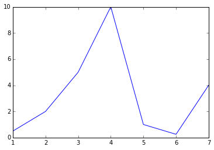


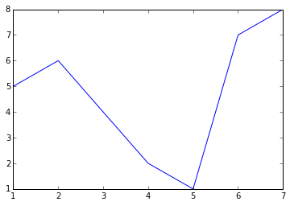


###3: Scale starting points

Scales can also have a zero point at different places.

Think of the number of cars in a parking lot.

Zero cars in the lot means that there are absolutely no cars at all in the lot, so absolute zero is at 0 cars. You can't have negative cars.

Now, think of degrees fahrenheit.

Zero degrees doesn't mean that there isn't any warmth -- the degree scale can also be negative, and absolute zero (when there is no warmth at all) is at -459.67 degrees.

Scales that don't have their absolute zero point at 0 don't enable us to take meaningful ratios.

If 4 cars parked in the lot yesterday, and 8 park today, I can safely say that twice as many cars are in the lot today.

But, if it was 32 degrees fahrenheit yesterday, and it is 64 degrees today, I can't say that it is twice as warm today as yesterday.

####Instructions

Convert the values in fahrenheit_degrees so that absolute zero is at the value 0. If you think this is already the case, don't change anything. Assign the result to degrees_zero.

Convert the values in yearly_town_population so that absolute zero is at the value 0. If you think this is already the case, don't change anything. Assign the result to population_zero.


```python
fahrenheit_degrees = [32, 64, 78, 102]
yearly_town_population = [100,102,103,110,105,120]
population_zero = yearly_town_population
degrees_zero = [f + 459.67 for f in fahrenheit_degrees]

print("degrees_zero:", degrees_zero)
```

    degrees_zero: [491.67, 523.6700000000001, 537.6700000000001, 561.6700000000001]
    

###4: Ordinal scales

So far, we've looked at equal interval and discrete scales, where all of the values are numbers.

But, we can also have ordinal scales, where items are ordered by rank.

For example, we could ask people how many cigarettes they smoke per day, and the answers could be "none", "a few", "some", "a lot".

These answers don't map exactly to numbers of cigarettes, but we know that "a few" is more than "none".

This is an ordinal rating scale, and we can assign numbers to the answers, in order, to make them easier to work with.

We could map 0 to "none", 1 to "a few", 2 to "some", and so on.

####Instructions

Assign the number that indicates its position on the scale to each survey response ("none" is 0, and so on).

Compute the average value of all the survey responses, and assign it to average_smoking.


```python
# Results from our survey on how many cigarettes people smoke per day
survey_responses = ["none", "some", "a lot", "none", "a few", "none", "none"]
survey_scale = ["none", "a few", "some", "a lot"]
survey_numbers = [survey_scale.index(response) for response in survey_responses]
average_smoking = float(sum(survey_numbers)) / len(survey_numbers)

print("average_smoking:", average_smoking)
```

    average_smoking: 0.8571428571428571
    

###5: Categorical scales

We can also have categorical scales, that have category labels.

One example is gender, which can be male or female.

There isn't an ordering between male and female -- on isn't greater than or less than the other, so it's not an ordinal scale.

You'll encounter categories a lot, and usually you'll use them to split data into groups.

####Instructions

Compute the average savings for everyone who is "male". Assign the result to male_savings.

Compute the average savings for everyone who is "female". Assign the result to female_savings.


```python
# Let's say that these lists are both columns in a matrix.  Index 0 in both is the first row, and so on.
gender = ["male", "female", "female", "male", "male", "female"]
savings = [1200, 5000, 3400, 2400, 2800, 4100]

male_savings_list = [savings[i] for i in range(0, len(gender)) if gender[i] == "male"]
female_savings_list = [savings[i] for i in range(0, len(gender)) if gender[i] == "female"]

male_savings = float(sum(male_savings_list)) / len(male_savings_list)
female_savings = float(sum(female_savings_list)) / len(female_savings_list)

print("male_savings:", male_savings)
print("female_savings:", female_savings)
```

    male_savings: 2133.3333333333335
    female_savings: 4166.666666666667
    

###6: Frequency histograms

Remember how statistics is all about counting? There's a plot called a frequency histogram that helps us visualize counts of data a lot better.

The idea is to count up how many times a value occurs in a list, and then graph the values on the x-axis, and the counts on the y-axis.

This lets us better understand how values fall in datasets.

####Instructions

Plot a histogram of student_scores.


```python
import matplotlib.pyplot as plt
%matplotlib inline

# Let's say that we watch cars drive by, and measure average speed in miles per hour.
average_speed = [10, 20, 25, 27, 28, 22, 15, 18, 17]
plt.hist(average_speed)
plt.show()

# Let's say we measure student test scores, from 0-100.
student_scores = [15, 80, 95, 100, 45, 75, 65]
plt.hist(student_scores)
plt.show()
```


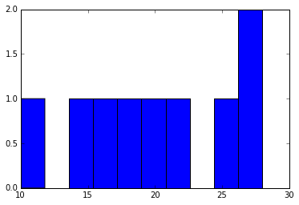


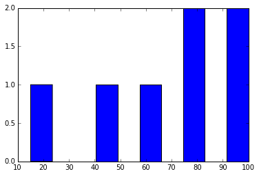


###7: Histogram bins

You may have noticed in the last screen that all of the values were plotted.

Histograms use something called bins to count up values.

If the x-axis ranges from 0 to 10, and we have 10 bins, the first bin would be 0-1, the second would be 1-2, and so on.

If we have 5 bins, the first would be 0-2, the second would be 2-4, and so on.

Any values in the list that fall within the bin would increase the count of the bin by one.

Bins allow us to better understand the shape and distribution of the data than graphing every count individually.

In the last screen, the default number of bins for a matplotlib plot is 10, and we had less values than that, so all the values were shown.

We'll experiment a bit with different numbers of bins to get a better intuition of how they work.

####Instructions

Plot a histogram of average_speed with only 2 bins.


```python
import matplotlib.pyplot as plt
%matplotlib inline

average_speed = [10, 20, 25, 27, 28, 22, 15, 18, 17]
plt.hist(average_speed, bins=6)
plt.show()

# As you can see, the values in the list are counted into the nearest bin.
# If we have less bins, each bin will have a higher count (because it's showing all of the values that fall into it)
# With more bins, the counts are less, because each bin contains less values.
plt.hist(average_speed, bins=4)
plt.show()

plt.hist(average_speed, bins=2)
plt.show()
```


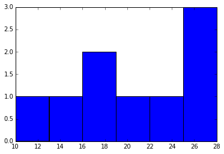


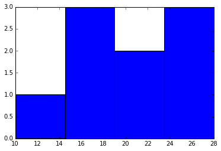


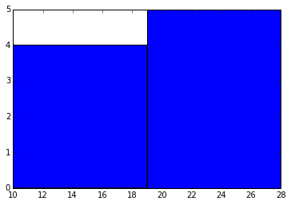


###8: Skew

Now that we know how to make histograms, notice how the plots have a "shape" to them?

These shapes are important, and can show you distributional parameters of the data.

The first parameter we'll look at is called skew.

####Instructions

Assign the skew of test_scores_positive to positive_skew.

Assign the skew of test_scores_negative to negative_skew.

Assign the skew of test_scores_normal to no_skew.


```python
# Some numpy arrays are already loaded in, and we'll make some plots with them.
# The arrays contain student test scores from an exam, on a 0-100 scale.
from scipy.stats import skew
from scipy.stats import gamma
import numpy as np
import matplotlib.pyplot as plt
%matplotlib inline

mu, sigma = 50, 5
test_scores_normal = np.random.normal(mu, sigma, 1000)
test_scores_positive = gamma.rvs(10, size=1000)
test_scores_negative = 100 - test_scores_positive

# See how there is a long slope to the left?
# The data is concentrated in the right part of the distribution, but some people also scored poorly.
# This plot is negatively skewed.
plt.hist(test_scores_negative)
plt.show()

# This plot has a long slope to the right.
# Most students did poorly, but a few did really well.
# This is positively skewed.
plt.hist(test_scores_positive)
plt.show()

# This plot has no skew either way -- most of the values are in the center, and there is no long slope either way.
# Is is an unskewed distribution.
plt.hist(test_scores_normal)
plt.show()

# We can test how skewed a distribution is using the skew function.
# A positive value means positive skew, a negative value means negative skew, and close to zero means no skew.

positive_skew = skew(test_scores_positive)
print("positive_skew:", positive_skew)

negative_skew = skew(test_scores_negative)
print("negative_skew:", negative_skew)

no_skew = skew(test_scores_normal)
print("no_skew:", no_skew)
```


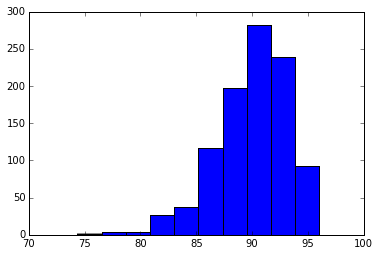


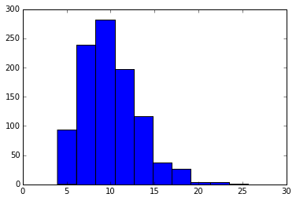


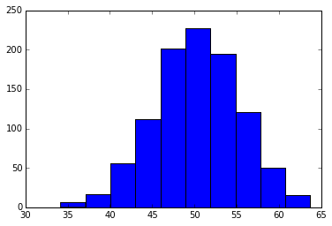


    positive_skew: 0.8451409400800027
    negative_skew: -0.8451409400800197
    no_skew: -0.11045767708531636
    

###9: Kurtosis

Another parameter of a distribution is called kurtosis.

Kurtosis measures whether the distribution is short and flat, or tall and skinny.

"Shorter" distributions have a lower maximum frequency, but higher subsequent frequencies.

####Instructions

Assign the kurtosis of test_scores_platy to kurt_platy.

Assign the kurtosis of test_scores_lepto to kurt_lepto.

Assign the kurtosis of test_scores_meso to kurt_meso.


```python
from scipy.stats import kurtosis
import matplotlib.pyplot as plt
%matplotlib inline

# This plot is short, making it platykurtic.
# See how the values are distributed pretty evenly, and there isn't a huge cluster in the middle?
# Students had a wide variation in their performance.
#plt.hist(test_scores_platy)
#plt.show()

# This plot is tall, and is leptokurtic.
# Most students did very similarly to the others.
#plt.hist(test_scores_lepto)
#plt.show()

# This plot is in between, and is mesokurtic.
#plt.hist(test_scores_meso)
#plt.show()

# We can measure kurtosis with the kurtosis function.
# Negative values indicate platykurtic distributions, positive values indicate leptokurtic distributions, and values close to 0 are mesokurtic.
#kurt_platy = kurtosis(test_scores_platy)
#kurt_lepto = kurtosis(test_scores_lepto)
#kurt_meso = kurtosis(test_scores_meso)
```

###10: Modality

Modality is another parameter of distributions.

Modality refers to the number of modes, or peaks, in a distribution.

Real-world data often is unimodal (only has one mode).

####Instructions

Plot test_scores_multi, which has four peaks.


```python
import matplotlib.pyplot as plt
%matplotlib inline

# This plot has one mode, making it unimodal.
#plt.hist(test_scores_uni)
#plt.show()

# This plot has two peaks, and is bimodal.
# This could happen if one group of students learned the material, and one learned something else, for example.
#plt.hist(test_scores_bi)
#plt.show()

# More than one peak means that the plot is multimodal.
# We can't easily measure the modality of a plot, like we can with kurtosis or skew.
# Often, the best way to detect multimodality is to observe the plot.
#plt.hist(test_scores_multi)
#plt.show()
```

###11: Measures of central tendency

Now that we know how to measure parameters of a distribution, let's look at central tendency measures.

These measure how likely points in the data are to cluster around a central point.

The first one we'll look at is the mean.

We've taken the mean before, but we'll look more closely at what it is.

The mean is just the sum of all the elements in an array divided by the number of elements.

####Instructions

Compute the mean of test_scores_normal, and assign to mean_normal.

Compute the mean of test_scores_negative, and assign to mean_negative.

Compute the mean of test_scores_positive, and assign to mean_positive.


```python
import matplotlib.pyplot as plt
%matplotlib inline

# We're going to put a line over our plot that shows the mean.
# This is the same histogram we plotted for skew a few screens ago.
plt.hist(test_scores_normal)
# We can use the .mean() method of a numpy array to compute the mean.
mean_test_score = test_scores_normal.mean()
# The axvline function will plot a vertical line over an existing plot.
plt.axvline(mean_test_score)

# Now we can show the plot and clear the figure.
plt.show()

# When we plot test_scores_negative, a very negatively skewed distribution, we see that the mean is pulled to the left by the small values there.
# The mean can be changed easily by very large or very small values.
# This can make it misleading with distributions that are very skewed, when we expect the mean to be the center.
plt.hist(test_scores_negative)
plt.axvline(test_scores_negative.mean())
plt.show()

# We can do the same with the positive side.
# See how the very high values pull the mean to the right more than you would expect?
plt.hist(test_scores_positive)
plt.axvline(test_scores_positive.mean())
plt.show()

mean_normal = test_scores_normal.mean()
print("mean_normal:", mean_normal)

mean_negative = test_scores_negative.mean()
print("mean_negative:", mean_negative)

mean_positive = test_scores_positive.mean()
print("mean_positive:", mean_positive)
```


    mean_normal: 50.2355217089
    mean_negative: 90.0357681146
    mean_positive: 9.96423188538
    

###12: The median

Another measure of central tendency is the median.

This is the midpoint of an array.

You have to sort the array, and then take the value in the middle.

If two values are in the middle (if there are an even number of items in the array), then you take the mean of the two middle values.

The median is less sensitive to very large or very small values (outliers), and is a more realistic center of the distribution.

####Instructions

Plot a histogram for test_scores_positive.

Add in a blue line for the median.

Add in a red line for the mean.


```python
# Let's plot the mean and median side by side in a negatively skewed distribution.
# Sadly, numpy arrays don't have a nice median method, so we have to use a numpy function to compute it.
import numpy
import matplotlib.pyplot as plt
%matplotlib inline

# Plot the histogram.
plt.hist(test_scores_negative)

# Compute the median.
median = numpy.median(test_scores_negative)

# Plot the median in blue (the color argument of "b" means blue).
plt.axvline(median, color="b")

# Plot the mean in red.
plt.axvline(test_scores_negative.mean(), color="r")

# See how the median is further to the right than the mean?
# It's less sensitive to outliers, and isn't pulled to the left.
plt.show()

plt.hist(test_scores_positive)
plt.axvline(numpy.median(test_scores_positive), color="b")
plt.axvline(test_scores_positive.mean(), color="r")
plt.show()
```


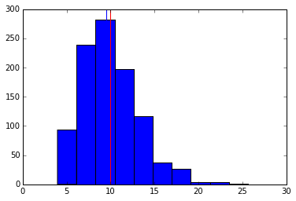


###13: Plotting Titanic data

Before we dive into cleaning up the data, let's take a look at why we need to deal with the missing values.

####Instructions

Play around with graphing if you want, then hit "Next" to continue


```python
import pandas

import matplotlib.pyplot as plt
%matplotlib inline

titanic_survival = pandas.read_csv("data/titanic.csv")
titanic_survival[:5]

# The titanic data is loaded into the titanic_survival variable, which is a pandas dataframe
# See the values that show up as NaN in the age column?  Those were missing in the original dataset
# NaN stands for not a number
#print(titanic_survival["age"])

# Now let's try plotting with the NaN values
#plt.hist(titanic_survival["age"])

# The above will fail with an error
# This is because we can't plot a value that doesn't exist (NaN)
# We need to deal with those values before we can proceed
```


<div>
<table border="1" class="dataframe">
  <thead>
    <tr style="text-align: right;">
      <th></th>
      <th>pclass</th>
      <th>survived</th>
      <th>name</th>
      <th>sex</th>
      <th>age</th>
      <th>sibsp</th>
      <th>parch</th>
      <th>ticket</th>
      <th>fare</th>
      <th>cabin</th>
      <th>embarked</th>
      <th>boat</th>
      <th>body</th>
      <th>home.dest</th>
    </tr>
  </thead>
  <tbody>
    <tr>
      <th>0</th>
      <td>3</td>
      <td>0</td>
      <td>Abbing, Mr. Anthony</td>
      <td>male</td>
      <td>42</td>
      <td>0</td>
      <td>0</td>
      <td>C.A. 5547</td>
      <td>7.55</td>
      <td>NaN</td>
      <td>S</td>
      <td>NaN</td>
      <td>NaN</td>
      <td>NaN</td>
    </tr>
    <tr>
      <th>1</th>
      <td>3</td>
      <td>0</td>
      <td>Abbott, Master. Eugene Joseph</td>
      <td>male</td>
      <td>13</td>
      <td>0</td>
      <td>2</td>
      <td>C.A. 2673</td>
      <td>20.25</td>
      <td>NaN</td>
      <td>S</td>
      <td>NaN</td>
      <td>NaN</td>
      <td>East Providence, RI</td>
    </tr>
    <tr>
      <th>2</th>
      <td>3</td>
      <td>0</td>
      <td>Abbott, Mr. Rossmore Edward</td>
      <td>male</td>
      <td>16</td>
      <td>1</td>
      <td>1</td>
      <td>C.A. 2673</td>
      <td>20.25</td>
      <td>NaN</td>
      <td>S</td>
      <td>NaN</td>
      <td>190</td>
      <td>East Providence, RI</td>
    </tr>
    <tr>
      <th>3</th>
      <td>3</td>
      <td>1</td>
      <td>Abbott, Mrs. Stanton (Rosa Hunt)</td>
      <td>female</td>
      <td>35</td>
      <td>1</td>
      <td>1</td>
      <td>C.A. 2673</td>
      <td>20.25</td>
      <td>NaN</td>
      <td>S</td>
      <td>A</td>
      <td>NaN</td>
      <td>East Providence, RI</td>
    </tr>
    <tr>
      <th>4</th>
      <td>3</td>
      <td>1</td>
      <td>Abelseth, Miss. Karen Marie</td>
      <td>female</td>
      <td>16</td>
      <td>0</td>
      <td>0</td>
      <td>348125</td>
      <td>7.65</td>
      <td>NaN</td>
      <td>S</td>
      <td>16</td>
      <td>NaN</td>
      <td>Norway Los Angeles, CA</td>
    </tr>
  </tbody>
</table>
</div>


###14: Cleaning missing data

Now that we know some statistics, let's practice on our Titanic data.

Our data is a manifest of all the passengers on the Titanic, a ship that sunk in April 1912.

It contains passenger names, ages, and other information (such as whether or not they survived).

Unfortunately, not all data is available -- some passengers don't have an age or other information listed.

Before we can analyze the data, we have to do something about the missing rows.

The easiest way to deal with them is to just remove all rows with missing data.

This isn't necessarily the best solution in all cases, but we'll learn about other ways to handle this later on.

####Instructions

Remove the NaN values in the "age" and "sex" columns.

Assign the result to new_titanic_survival.


```python
# Luckily, pandas dataframes have a method that can drop rows that have missing data
# Let's look at how big the dataframe is first
print("titanic_survival.shape:", titanic_survival.shape)

# There were 1310 passengers on the titanic, according to our data
# Now let's drop any row with missing data
# The dropna method on dataframes will do this for us
# Any row with any missing values will be removed
new_titanic_survival = titanic_survival.dropna()

# Hmm, it looks like we were too zealous with dropping rows with na values
# We now have no rows in our dataframe
# This is because some of the later columns, which aren't immediately relevant to our analysis, have a lot of missing values
print("new_titanic_survival.shape:", new_titanic_survival.shape)

# We can use the subset keyword argument to the dropna method to only drop rows if there are na values in certain columns
# This will drop any row where the embarkation port (where people boarded the Titanic), or cabin number is missing
new_titanic_survival = titanic_survival.dropna(subset=["embarked", "cabin"])

# This is much better -- we have removed only the rows that we need to remove.
print("new_titanic_survival.shape:", new_titanic_survival.shape)
new_titanic_survival = titanic_survival.dropna(subset=["age", "sex"])
```

    titanic_survival.shape: (1309, 14)
    new_titanic_survival.shape: (0, 14)
    new_titanic_survival.shape: (293, 14)
    

###15: Plotting age

Now that we have cleaned up data, let's analyze it.

####Instructions

Plot a histogram of the "age" column in titanic_survival.

Add in a blue line for the median.

Add in a red line for the mean.


```python
# The cleaned up data has been loaded into the 'titanic_survival' variable.
import numpy
import matplotlib.pyplot as plt
%matplotlib inline

plt.hist(new_titanic_survival["age"])
plt.axvline(numpy.median(new_titanic_survival["age"]), color="b")
plt.axvline(new_titanic_survival["age"].mean(), color="r")
plt.show()
```


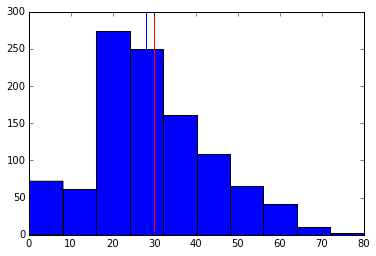


###16: Calculating indices for age

The age distribution was very interesting, and showed that a lot of people in their 20s-40s were travelling without children.

Now that we know what the distribution looks like, let's calculate the parameters and central tendency measures.

####Instructions

Assign the mean of the "age" column of titanic_survival to mean_age.

Assign the median of the "age" column of titanic_survival to median_age.

Assign the skew of the "age" column of titanic_survival to skew_age.

Assign the kurtosis of the "age" column of titanic_survival to kurtosis_age.


```python
# The cleaned up data has been loaded into the titanic_survival variable
import numpy
from scipy.stats import skew
from scipy.stats import kurtosis

mean_age = new_titanic_survival["age"].mean()
print("mean_age:", mean_age)

median_age = numpy.median(new_titanic_survival["age"])
print("median_age:", median_age)

skew_age = skew(new_titanic_survival["age"])
print("skew_age:", skew_age)

kurtosis_age = kurtosis(new_titanic_survival["age"])
print("kurtosis_age:", kurtosis_age)
```

    mean_age: 29.8811345124283
    median_age: 28.0
    skew_age: 0.4070870379484179
    kurtosis_age: 0.14051780299368888
    
